# My portable environment

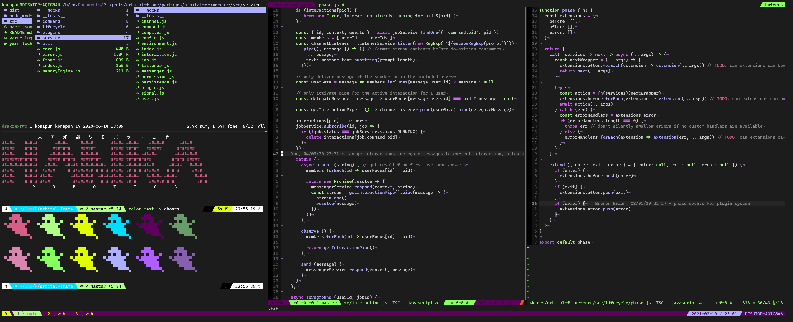
tmux, ranger, zsh, and neovim with eva01 theme

I regularly jump across Windows, MacOS, and various Linux DEs so this is an attempt to script my environment to be usable wherever I go. This
setup is used and confirmed working on Mac OS, Ubuntu 18.04, Ubuntu 20.04 (WSL), Android (via Termux), and Raspberry Pi OS (Raspian) on armv7.

In particular, this provides installation and configuration for:

  * core packages
  * bat
  * bpytop
  * chrome (only as link to chrome theme)
  * highlight (used for syntax highlighting by some system utilities and ranger)
  * git
  * neovim
  * tmux
  * ranger
  * slack (suggested sidebar theme)
  * zsh (and sets up replacements for cat and ls)
  * fonts
  * Windows Terminal (where available)
  * Windows Theme (where available)
  * Gnome Terminal (where available)
  * Alacritty (where available)
  * Kitty (where available)
  * A selection of wallpapers which match the included themes
  * (more coming soon as I get it working for my bspwm setup)

## Prerequisites
zsh
brew (if on macOS)

## Installing
The installation/configuration script is modular. To install everything, simply run `zsh ./install.zsh` (sudo is required on Linux).

Alternatively, you can install the following targets separately by running `zsh ./install.zsh [target1 target2 ...]` where a target is one of:

  * **packages** install all apt/brew/cargo/npm/pip/etc programs
  * **tmux** install configuration and associated plugins for tmux
  * **zsh** install oh-my-zsh and associated configuration, including aliases and custom functions (fzf, color scripts, etc)
  * **bat** install configuration for bat
  * **git** install git aliases and config
  * **nvim** install neovim configuration
  * **highlight** install highlight configuration (for syntax highlighting within various unix utilities)
  * **ranger** install ranger configuration
  * **bpytop** install bpytop configuration
  * **winterm** install configuration for Windows Terminal (where applicable)
  * **fonts** install fonts associated with this configuration. Will set default font where available
  * **alacritty** install configuration for alacritty (where available)
  * **gnome-terminal** install configuration for gnome terminal (where available)
  * **slack** generate sidebar theme for slack
  * **chrome** link to suggested chrome theme in web store

## Theming
Theme support is provided via a simple `sed`-based template system. Any configuration file can specify a template variable by enclosing a key
within double curly braces (e.g. `{{my_template_variable}}`). The theme script then replaces these variables with values from the loaded theme.
Some theming is done by specifying hex colors while other theming is done by taking advantage of provided themes.

To use a theme, run the install script with the `-t` option followed by the theme name: `./install.zsh -t dracula`

### default
(attempts to use configurations which make terminal utilities respect shell colors)

### all-hallows-eve
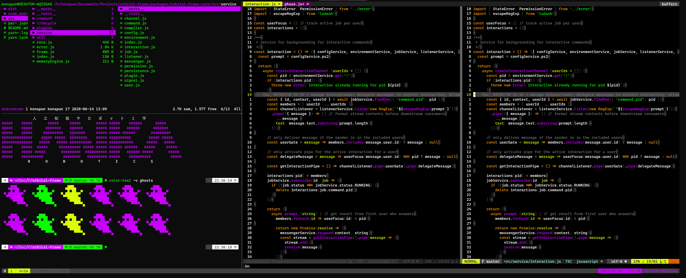

### cyberpunk
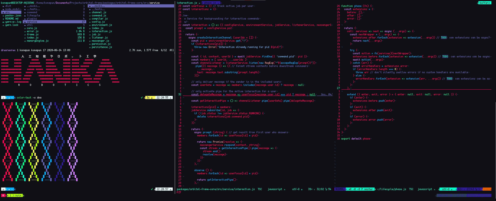

### dracula
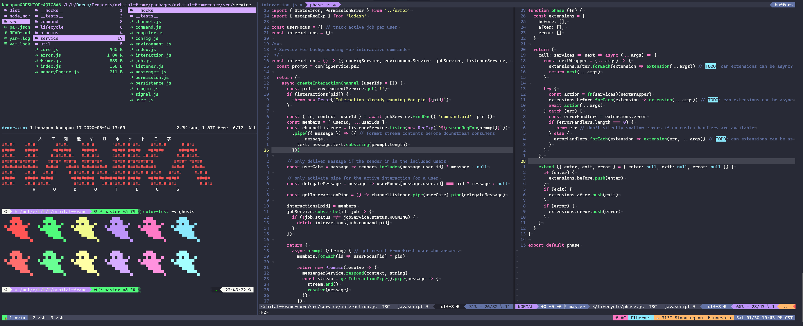

### eva01

### farout
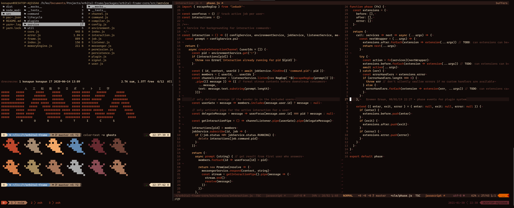

### gruvbox
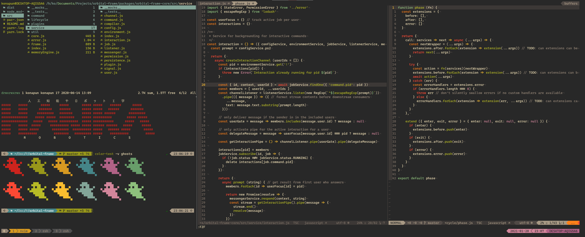

### kawaii
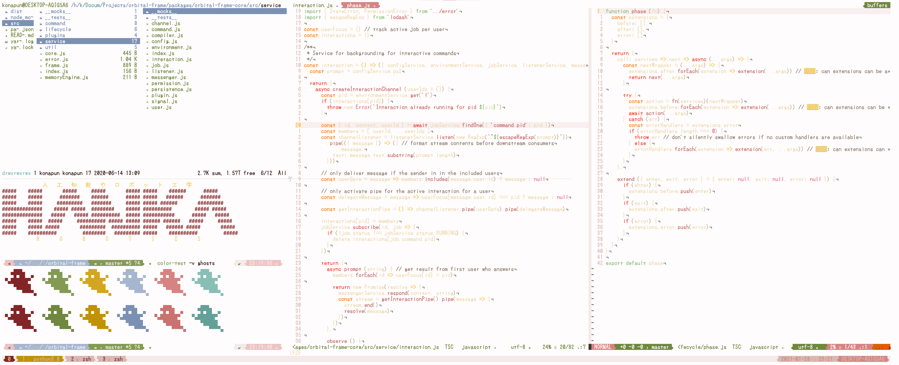

### lighthaus
(partial theme only - no vim yet)

### monokai
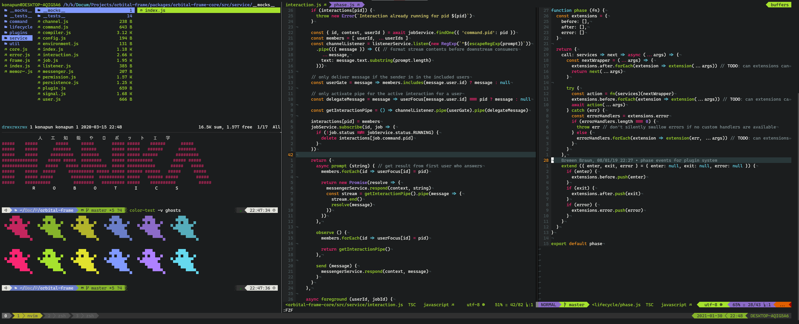

### nord
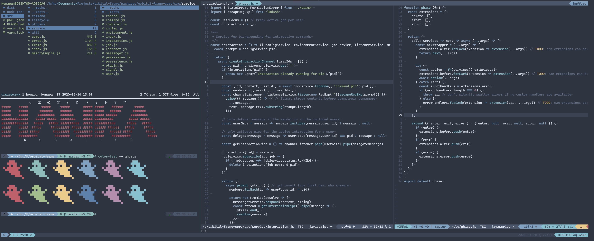

### one-dark
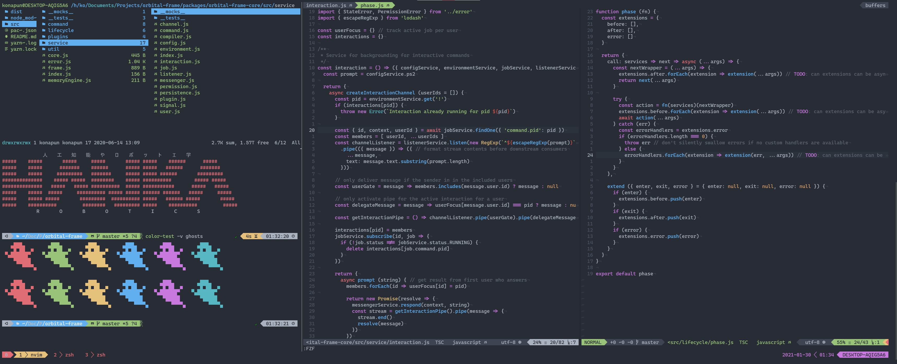

### rose-pine
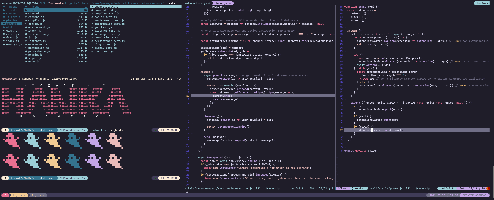

### salvation
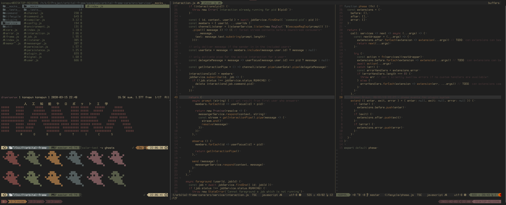

### xp
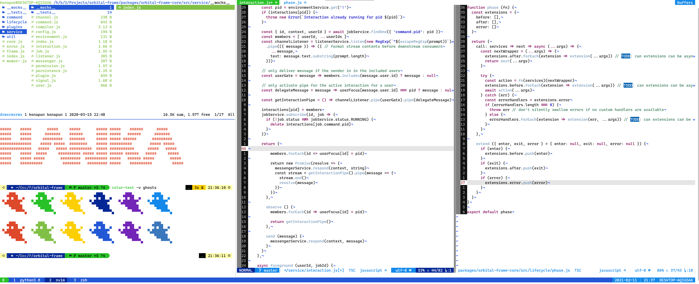
